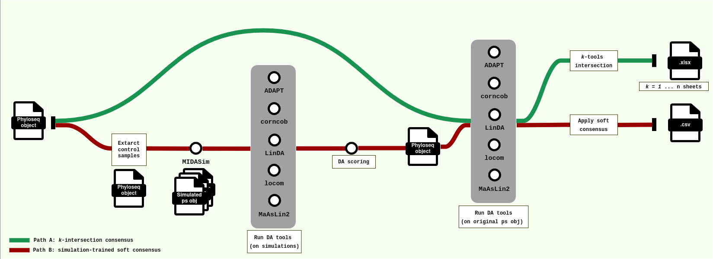

<h1>
  <picture>
    <source media="(prefers-color-scheme: dark)" srcset="docs/images/nf-core-daamicrobiome_logo_dark.png">
    
  </picture>
</h1>

[](https://github.com/codespaces/new/nf-core/daamicrobiome)
[](https://github.com/nf-core/daamicrobiome/actions/workflows/nf-test.yml)
[](https://github.com/nf-core/daamicrobiome/actions/workflows/linting.yml)[](https://nf-co.re/daamicrobiome/results)[](https://doi.org/10.5281/zenodo.XXXXXXX)
[](https://www.nf-test.com)

[](https://www.nextflow.io/)
[](https://github.com/nf-core/tools/releases/tag/4.0.2)
[](https://docs.conda.io/en/latest/)
[](https://www.docker.com/)
[](https://sylabs.io/docs/)
[](https://cloud.seqera.io/launch?pipeline=https://github.com/nf-core/daamicrobiome)

[](https://nfcore.slack.com/channels/daamicrobiome)[](https://bsky.app/profile/nf-co.re)[](https://mstdn.science/@nf_core)[](https://www.youtube.com/c/nf-core)

## Introduction

**nf-core/daamicrobiome** is a bioinformatics pipeline for microbiome differential abundance (DA) analysis that runs multiple DA tools in parallel and combines their results into a consensus. It takes a [phyloseq](https://joey711.github.io/phyloseq/) RDS object as input and supports two analysis paths:

- **Path A — k-intersection consensus**: runs DA tools on real data and reports taxa called differentially abundant by at least _k_ tools in agreement.
- **Path B — simulation-based weighted consensus** (default): uses [MIDASim](https://github.com/mengyu-he/MIDASim) to generate ground-truth simulated datasets from control samples, scores each DA tool's performance on these simulations, and applies the learned per-tool weights to the real-data results.

### DA tools included

| Tool | Reference |
|------|-----------|
| [ADAPT](https://bioconductor.org/packages/ADAPT/) | Wang & Mukai, 2024 |
| [corncob](https://github.com/statdivlab/corncob) | Martin et al., 2020 |
| [LinDA](https://github.com/zhouhj1994/LinDA) | Zhou et al., 2022 |
| [LOCOM](https://github.com/yijuanhu/LOCOM) | Hu et al., 2022 |
| [MaAsLin2](https://huttenhower.sph.harvard.edu/maaslin/) | Mallick et al., 2021 |
| [metagenomeSeq](https://bioconductor.org/packages/metagenomeSeq/) | Paulson et al., 2013 |

### Pipeline overview

<p align="center">
  
</p>

1. **Control extraction** (Path B) — subset control/healthy samples from the input phyloseq (or use a provided control-only object)
2. **Simulation** (Path B) — generate ground-truth datasets with known DA taxa via MIDASim
3. **DA analysis** — run the enabled DA tools on simulated and/or real data
4. **Scoring** (Path B) — evaluate each tool's sensitivity, specificity, and FDR on simulations to derive per-tool weights
5. **Consensus** — combine results via weighted consensus (Path B) or k-intersection (Path A)

## Usage

> [!NOTE]
> If you are new to Nextflow and nf-core, please refer to [this page](https://nf-co.re/docs/get_started/environment_setup/overview) on how to set-up Nextflow. Make sure to [test your setup](https://nf-co.re/docs/get_started/run-your-first-pipeline) with `-profile test` before running the workflow on actual data.

### Input

The pipeline requires a **phyloseq RDS object** (`.RDS`) containing an OTU/ASV count table, sample metadata with a condition/group column, and a taxonomy table.

### Path A: k-intersection consensus

```bash
nextflow run nf-core/daamicrobiome \
  -profile docker \
  --input phyloseq.RDS \
  --simulate false \
  --condition "study_condition" \
  --base_level "healthy" \
  --outdir results/
```

### Path B: simulation-trained weighted consensus (default)

```bash
nextflow run nf-core/daamicrobiome \
  -profile docker \
  --input phyloseq.RDS \
  --simulate true \
  --condition "study_condition" \
  --base_level "healthy" \
  --outdir results/
```

> [!WARNING]
> Please provide pipeline parameters via the CLI or Nextflow `-params-file` option. Custom config files including those provided by the `-c` Nextflow option can be used to provide any configuration _**except for parameters**_; see [docs](https://nf-co.re/docs/running/run-pipelines#using-parameter-files).

For the full list of parameters (DA tool toggles, simulation settings, scoring thresholds, resource limits), please refer to the [usage documentation](https://nf-co.re/daamicrobiome/usage) and the [parameter documentation](https://nf-co.re/daamicrobiome/parameters).

## Pipeline output

To see the results of an example test run with a full size dataset refer to the [results](https://nf-co.re/daamicrobiome/results) tab on the nf-core website pipeline page.
For more details about the output files and reports, please refer to the
[output documentation](https://nf-co.re/daamicrobiome/output).

## Credits

nf-core/daamicrobiome was originally written by Martina Cardinali and Toni Gabaldón.

We thank the following people for their extensive assistance in the development of this pipeline:

<!-- TODO nf-core: If applicable, make list of people who have also contributed -->

## Contributions and Support

If you would like to contribute to this pipeline, please see the [contributing guidelines](docs/CONTRIBUTING.md).

For further information or help, don't hesitate to get in touch on the [Slack `#daamicrobiome` channel](https://nfcore.slack.com/channels/daamicrobiome) (you can join with [this invite](https://nf-co.re/join/slack)).

## Citations

<!-- TODO nf-core: Add citation for pipeline after first release. Uncomment lines below and update Zenodo doi and badge at the top of this file. -->
<!-- If you use nf-core/daamicrobiome for your analysis, please cite it using the following doi: [10.5281/zenodo.XXXXXX](https://doi.org/10.5281/zenodo.XXXXXX) -->

An extensive list of references for the tools used by the pipeline can be found in the [`CITATIONS.md`](CITATIONS.md) file.

You can cite the `nf-core` publication as follows:

> **The nf-core framework for community-curated bioinformatics pipelines.**
>
> Philip Ewels, Alexander Peltzer, Sven Fillinger, Harshil Patel, Johannes Alneberg, Andreas Wilm, Maxime Ulysse Garcia, Paolo Di Tommaso & Sven Nahnsen.
>
> _Nat Biotechnol._ 2020 Feb 13. doi: [10.1038/s41587-020-0439-x](https://dx.doi.org/10.1038/s41587-020-0439-x).